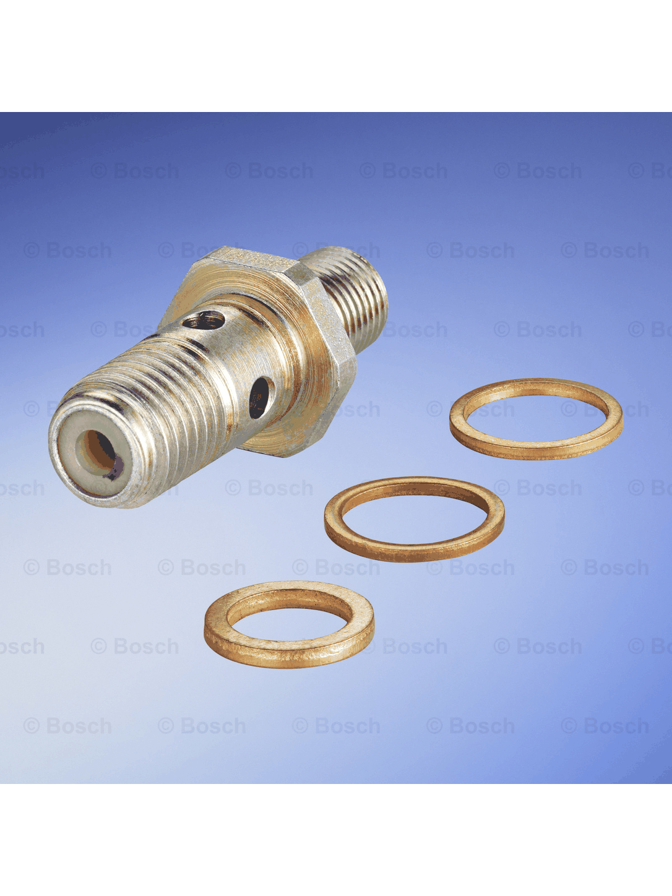

# Product Card Processor

A Python CLI tool for preparing product images for marketplace cards.

The tool can batch-process product images, resize them relative to a canvas or template, optionally remove the background with neural network models, and place the processed product image onto a marketplace-style card.

## Demo



## Current version

v0.18 — Docker support

## Key features

* Batch processing of product images
* Support for `.jpg`, `.jpeg`, `.png`, and `.webp`
* Product resizing relative to a canvas or template
* Custom canvas size support
* Custom template/background support
* Product positioning with `--offset-x` and `--offset-y`
* Relative product scaling with `--product-scale`
* Optional background removal with neural network models
* Background removal backend selection with `--bg-backend`
* Background removal model selection with `--bg-model`
* Reuse of rembg sessions for faster batch processing
* Correct handling of transparent RGBA images using alpha masks
* Controlled parallel batch processing with `--workers`
* Progress output during batch processing
* JSON processing report export
* Total file count, worker count, failed files, and processing time in reports
* Friendly errors for missing or empty input folders
* Broken image skipping without stopping the whole batch
* High-quality resize with LANCZOS
* Optional `--no-upscale` mode for small images
* Docker support for reproducible local execution
* Docker volume support for input/output files
* Docker model cache volume for background removal models

## Supported file extensions

* `.jpg`
* `.jpeg`
* `.png`
* `.webp`

## Project structure

```text
product_card_processor/
├── app/
│   ├── __init__.py
│   ├── background_removal.py
│   ├── cli.py
│   ├── config.py
│   ├── image_io.py
│   ├── processor.py
│   └── transforms.py
├── data/
│   ├── input/
│   ├── output/
│   └── template.png
├── docs/
│   └── assets/
│       └── demo_frames/
├── tools/
│   └── make_gif.py
├── Dockerfile
├── .dockerignore
├── requirements.txt
└── README.md
```

## Requirements

The project uses `rembg` with CPU support for background removal.

Install dependencies:

```bash
pip install -r requirements.txt
```

Background removal models are downloaded automatically on first use.

Large models may require additional disk space and may take longer to download. For example, `birefnet-general` is significantly heavier than the default model.

## Basic usage

Process images from the default input folder and save results to the default output folder:

```bash
python -m app.cli --input data/input --output data/output
```

Show all available CLI options:

```bash
python -m app.cli --help
```

## Parallel batch processing

The tool supports controlled parallel batch processing with a configurable number of worker threads.

Use one worker for regular sequential processing:

```bash
python -m app.cli --template data/template.png --product-scale 0.6 --workers 1
```

Use multiple workers for parallel processing:

```bash
python -m app.cli --template data/template.png --product-scale 0.6 --workers 4
```

Parallel processing can improve performance on large image batches, especially when processing many files without heavy background removal.

When background removal is enabled, using too many workers may increase memory usage because neural network inference is more resource-intensive.

Recommended starting points:

| Mode                                        | Recommended workers |
| ------------------------------------------- | ------------------: |
| Resize/template processing only             |               `2–8` |
| Background removal with `u2net`             |               `1–4` |
| Background removal with `isnet-general-use` |               `1–2` |
| Background removal with `birefnet-general`  |               `1–2` |

If background removal is enabled with more than two workers, the tool prints a warning about possible memory usage increase.

## Canvas and template options

Use a custom canvas size:

```bash
python -m app.cli --canvas-width 1200 --canvas-height 1600
```

Use a custom template/background:

```bash
python -m app.cli --template data/template.png
```

When a template is provided, the output image size is based on the template size.

## Product scaling and positioning

Resize the product relative to the canvas or template size:

```bash
python -m app.cli --product-scale 0.8
```

Use a template with relative product scaling:

```bash
python -m app.cli --template data/template.png --product-scale 0.6
```

Move the product from the center using pixel offsets:

```bash
python -m app.cli --template data/template.png --offset-y -100
```

```bash
python -m app.cli --template data/template.png --offset-x 50 --offset-y -120
```

Disable upscaling for small images:

```bash
python -m app.cli --no-upscale
```

## Background removal

Remove product background before placing it on the canvas or template:

```bash
python -m app.cli --remove-bg --template data/template.png --product-scale 0.6
```

Remove product background with the selected backend:

```bash
python -m app.cli --remove-bg --bg-backend rembg --template data/template.png --product-scale 0.6
```

Select a background removal model:

```bash
python -m app.cli --remove-bg --bg-model u2net --template data/template.png --product-scale 0.6
```

```bash
python -m app.cli --remove-bg --bg-model isnet-general-use --template data/template.png --product-scale 0.6
```

```bash
python -m app.cli --remove-bg --bg-model birefnet-general --template data/template.png --product-scale 0.6
```

## Supported background removal models

| Model               | Description                                      | Notes                                                          |
| ------------------- | ------------------------------------------------ | -------------------------------------------------------------- |
| `u2net`             | Default general-purpose background removal model | Good lightweight baseline                                      |
| `isnet-general-use` | General-purpose object segmentation model        | Best balance in the current tests                              |
| `birefnet-general`  | Larger general-purpose segmentation model        | Best quality in the current tests, but much heavier and slower |

## Recommended usage

For most regular product images:

```bash
python -m app.cli --remove-bg --bg-model isnet-general-use --template data/template.png --product-scale 0.6 --workers 2
```

For faster lightweight processing:

```bash
python -m app.cli --remove-bg --bg-model u2net --template data/template.png --product-scale 0.6 --workers 4
```

For best quality on difficult product images:

```bash
python -m app.cli --remove-bg --bg-model birefnet-general --template data/template.png --product-scale 0.6 --workers 1
```

## JSON processing report

The tool can save a JSON report with processing statistics, selected settings, failed files, total file count, worker count, and total processing time.

Save a report to the default path:

```bash
python -m app.cli --remove-bg --bg-model isnet-general-use --template data/template.png --product-scale 0.6 --save-report
```

Save a report to a custom path:

```bash
python -m app.cli --remove-bg --bg-model isnet-general-use --template data/template.png --product-scale 0.6 --save-report --report-path reports/test_report.json
```

Example report structure:

```json
{
    "processed_count": 11,
    "failed_count": 1,
    "failed_files": [
        {
            "image_path": "data\\input\\broken.jpg",
            "reason": "cannot identify image file"
        }
    ],
    "total_files": 12,
    "settings": {
        "input_folder": "data\\input",
        "output_folder": "data\\output",
        "canvas_width": 1080,
        "canvas_height": 1440,
        "allow_upscale": true,
        "template_path": "data\\template.png",
        "offset_x": 0,
        "offset_y": 0,
        "product_scale": 0.6,
        "remove_bg": true,
        "bg_backend": "rembg",
        "bg_model": "isnet-general-use",
        "workers": 4
    },
    "processing_time_seconds": 17.45
}
```

## Docker support

The project can be run inside Docker, so it does not require a local Python virtual environment to process images.

Docker support was added in:

```text
v0.18 — Docker support
```

## Build Docker image

From the project root, run:

```powershell
docker build -t product-card-processor .
```

This command builds a Docker image named:

```text
product-card-processor
```

## Run CLI help in Docker

To check that the container starts correctly:

```powershell
docker run --rm product-card-processor
```

By default, the container runs:

```powershell
python -m app.cli --help
```

So it should print the available CLI arguments.

## Run image processing in Docker without background removal

Input images should be placed in:

```text
data/input
```

The processed images will be saved to:

```text
data/output
```

PowerShell command:

```powershell
docker run --rm `
  -v "${PWD}\data:/app/data" `
  product-card-processor `
  python -m app.cli --input data/input --output data/output --template data/template.png --product-scale 0.6 --workers 2 --save-report
```

Explanation:

```text
-v "${PWD}\data:/app/data"
```

mounts the local `data` folder into the container.

This allows Docker to read images from the local folder:

```text
data/input
```

and save results back to:

```text
data/output
```

## Run image processing in Docker with background removal

Background removal is supported through `rembg`.

For background removal, it is recommended to start with:

```text
--workers 1
```

because background removal is more memory-intensive than regular resizing and composition.

PowerShell command:

```powershell
docker run --rm `
  -v "${PWD}\data:/app/data" `
  -v product_card_models:/models `
  -e U2NET_HOME=/models `
  product-card-processor `
  python -m app.cli --input data/input --output data/output_bg --template data/template.png --product-scale 0.6 --remove-bg --bg-model u2net --workers 1 --save-report --report-path data/output_bg/report.json
```

The processed images will be saved to:

```text
data/output_bg
```

The JSON report will be saved to:

```text
data/output_bg/report.json
```

## Docker model cache volume

The Docker background removal command uses a Docker volume:

```powershell
-v product_card_models:/models
```

and an environment variable:

```powershell
-e U2NET_HOME=/models
```

This is needed so that the `rembg` model is downloaded only once and reused between container runs.

Without this volume, the model could be downloaded again when the container is recreated.

The first run with background removal may take longer because the model needs to be downloaded:

```text
u2net.onnx
```

After that, repeated runs should start faster.

## Docker example report

Example report created after Docker processing with background removal:

```json
{
    "processed_count": 11,
    "failed_count": 0,
    "failed_files": [],
    "total_files": 11,
    "settings": {
        "input_folder": "data/input",
        "output_folder": "data/output_bg",
        "canvas_width": 1080,
        "canvas_height": 1440,
        "allow_upscale": true,
        "template_path": "data/template.png",
        "offset_x": 0,
        "offset_y": 0,
        "product_scale": 0.6,
        "remove_bg": true,
        "bg_backend": "rembg",
        "bg_model": "u2net",
        "workers": 1
    },
    "processing_time_seconds": 89.569
}
```

## Docker commands summary

Build image:

```powershell
docker build -t product-card-processor .
```

Run help:

```powershell
docker run --rm product-card-processor
```

Run without background removal:

```powershell
docker run --rm `
  -v "${PWD}\data:/app/data" `
  product-card-processor `
  python -m app.cli --input data/input --output data/output --template data/template.png --product-scale 0.6 --workers 2 --save-report
```

Run with background removal:

```powershell
docker run --rm `
  -v "${PWD}\data:/app/data" `
  -v product_card_models:/models `
  -e U2NET_HOME=/models `
  product-card-processor `
  python -m app.cli --input data/input --output data/output_bg --template data/template.png --product-scale 0.6 --remove-bg --bg-model u2net --workers 1 --save-report --report-path data/output_bg/report.json
```

## Docker troubleshooting

### Build fails because of slow package download

If Docker build fails because of a network timeout while installing Python packages, try running the build again:

```powershell
docker build -t product-card-processor .
```

If the issue persists, check the `Dockerfile` and make sure `pip` uses increased timeout and retries.

Example:

```dockerfile
RUN pip install --no-cache-dir --timeout=120 --retries=10 --progress-bar off -r requirements.txt
```

### Build fails because Docker runs out of memory

If the build fails with a message like:

```text
cannot allocate memory
```

increase Docker Desktop resources:

```text
Docker Desktop → Settings → Resources
```

Recommended starting point:

```text
Memory: 4 GB or more
Swap: 2 GB or more
```

### Background removal is slow in Docker

Background removal uses neural network inference and is much heavier than regular image resizing.

Start with:

```text
--workers 1
```

Then increase worker count carefully if the system has enough memory.

## Model comparison workflow

To compare background removal models, process the same input folder with different models and save the results into separate output folders.

### U2Net

```bash
python -m app.cli --remove-bg --bg-model u2net --template data/template.png --product-scale 0.6 --output data/output/u2net
```

### IS-Net general use

```bash
python -m app.cli --remove-bg --bg-model isnet-general-use --template data/template.png --product-scale 0.6 --output data/output/isnet-general-use
```

### BiRefNet general

```bash
python -m app.cli --remove-bg --bg-model birefnet-general --template data/template.png --product-scale 0.6 --output data/output/birefnet-general
```

## Performance measurement

Processing time was measured locally with PowerShell `Measure-Command`.

Example:

```powershell
Measure-Command { python -m app.cli --remove-bg --bg-model u2net --template data/template.png --product-scale 0.6 --output data/output/u2net }
```

The measurements below are based on the current local test set and environment. Actual results may vary depending on hardware, image resolution, number of files, selected worker count, selected background removal model, and whether the model has already been downloaded.

| Model               | Total time, seconds |            Relative speed | Notes                                 |
| ------------------- | ------------------: | ------------------------: | ------------------------------------- |
| `u2net`             |                6.85 |                      1.0x | Fastest tested model                  |
| `isnet-general-use` |               12.89 |  1.9x slower than `u2net` | Slower, but better quality            |
| `birefnet-general`  |              185.24 | 27.0x slower than `u2net` | Best quality, but very slow and heavy |

## Model comparison criteria

The models were compared manually using real automotive product images.

The main criteria were:

* object edge quality
* preservation of small details
* handling of holes and inner cutouts
* shadow and reflection removal
* processing speed
* model size and disk space usage
* stability on different product types

## Current observations

The following models were tested:

* `u2net`
* `isnet-general-use`
* `birefnet-general`

### U2Net

`u2net` works as a solid baseline model.

It handles simple product shapes reasonably well, but it shows weaker results on more difficult geometry, especially inner cutouts, holes, and complex object boundaries.

It was the fastest model in the current test run.

Recommended role:

* lightweight baseline
* fastest tested option
* useful when speed and model size matter more than maximum quality

### IS-Net general use

`isnet-general-use` produced cleaner masks than `u2net` in the tested examples.

It handled several product images more accurately and provided a better balance between quality and practical usability.

It was slower than `u2net`, but still much faster than `birefnet-general`.

Recommended role:

* best balanced option
* good candidate for the default model
* suitable for regular batch processing

### BiRefNet general

`birefnet-general` produced the best masks in the tested examples.

It handled complex product geometry and inner cutouts better than the other tested models. However, it is significantly heavier and much slower.

In the current test run, it was about 27 times slower than `u2net`.

Recommended role:

* best quality option
* useful for difficult product images
* suitable when quality is more important than speed and model size

## Model comparison summary

| Model               | Quality   | Speed     | Practicality | Notes                                                 |
| ------------------- | --------- | --------- | ------------ | ----------------------------------------------------- |
| `u2net`             | Medium    | Fast      | High         | Good lightweight baseline, weaker on difficult shapes |
| `isnet-general-use` | High      | Medium    | High         | Best balance between quality and usability            |
| `birefnet-general`  | Very high | Very slow | Medium       | Best quality, but heavy and much slower               |

## Demo GIF generation

The README demo GIF can be regenerated from two prepared frames:

```bash
python tools/make_gif.py
```

Input frames:

```text
docs/assets/demo_frames/before.jpg
docs/assets/demo_frames/after.jpg
```

Expected output:

```text
docs/assets/demo_frames/demo_1.gif
```

The GIF generation script keeps the original image proportions and fits frames into a shared canvas instead of stretching them.

## Project roadmap

### Completed

* `v0.1` — project structure
* `v0.2` — single image processing
* `v0.3` — batch image processing
* `v0.4` — centered product card generation
* `v0.5` — configurable CLI arguments
* `v0.6` — friendly error handling
* `v0.7` — improved resize behavior and `--no-upscale`
* `v0.8` — template/background support
* `v0.9` — pixel offsets from center
* `v0.10` — relative product scaling
* `v0.11` — background removal with rembg backend
* `v0.12` — rembg session reuse for faster batch processing
* `v0.13` — background removal model selection
* `v0.14` — background removal model comparison
* `v0.15` — JSON processing report
* `v0.16` — README demo GIF
* `v0.17` — controlled parallel batch processing
* `v0.18` — Docker support

### Planned features

* Add FastAPI backend
* Add web interface
* Add recursive folder processing
* Add configuration presets
